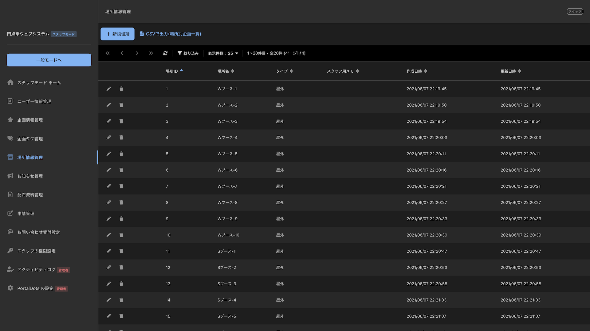
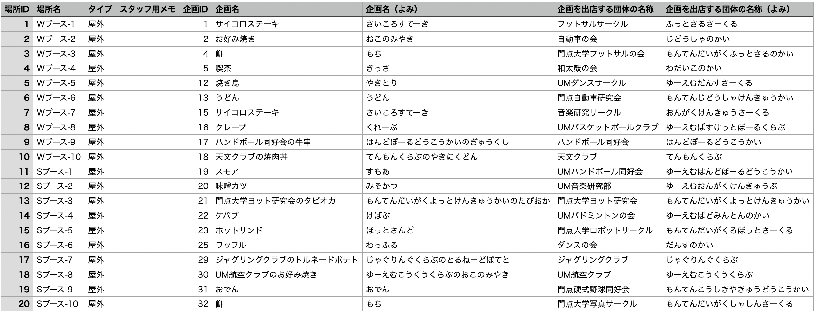

# 学園祭当日に使用できる場所の一覧や各企画への場所の割り当てを管理する

## 概要

PortalDotsの「場所情報管理」機能を利用することで、学園祭当日に各企画が利用することのできる場所の一覧を管理することができます。各場所はタイプ（屋内・屋外・特殊場所）別に分類することができます。また、各場所の特徴などをメモとして残しておくこともできます。

PortalDotsの「企画情報管理」機能では、各企画が使用する場所を登録することができます。各場所における企画の割り当て一覧をCSV形式で出力し、Excelで管理することもできます。

## 「場所」を登録する

1. 「スタッフモード」を開きます。
2. メニューから「場所情報管理」を選びます。
3. 「新規場所」を選びます。
4. 以下の表に記載されている入力欄が表示されます。入力欄に入力し終わったら「保存」を選びます。

| 入力項目    | 説明                                                              |
| ------- | --------------------------------------------------------------- |
| 場所名     | 登録する場所の名前を入力します。模擬店の場合はブース名、教室の場合は教室名を入力するのがおすすめです。             |
| タイプ     | 場所が「屋外」か「屋内」のどちらにあるのかを選択できます。どちらの分類にも当てはまらない場合は「特殊場所」を選択してください。 |
| スタッフ用メモ | 一般ユーザーには公開されないスタッフ用のメモを入力できます。                                  |

## 各企画に場所を割り当てる

PortalDotsに登録している企画情報には、それぞれの企画が使用する場所を割り当てることができます。企画に場所を割り当てることで場所の使用状況をPortalDots上で管理できるようになります。

また、各企画に所属しているメンバーがPortalDotsにログインすると、ホーム画面の「企画情報」欄に「使用場所」が表示されるようになります（上図）。これにより、各企画が使用する場所をPortalDots上で簡単に連絡できます。

1. 「スタッフモード」を開きます。
2. メニューから「企画情報管理」を選びます。
3. 場所を割り当てたい企画の✏️(編集)ボタンを選びます。
4. 「使用場所」欄に、「場所情報管理」で登録した場所の名前を入力します。
5. 「保存」を選びます。

## 各場所に割り当てられている企画の一覧をCSV形式でダウンロードする

PortalDotsに登録した「場所」の情報や、各場所を使用する「企画」の情報をCSV形式でダウンロードすることができます。

1. 「スタッフモード」を開きます。
2. メニューから「場所情報管理」を選びます。
3. 「CSVで出力(場所別企画一覧)」を選びます。


「企画情報管理」ページでダウンロードできるCSVファイルにも、各企画の使用場所情報が含まれます。

「企画情報管理」ページでダウンロードできるCSVファイルは「企画ID」順で出力されるのに対し、「場所情報管理」ページでダウンロードできるCSVファイルは「場所ID」順で出力されます。

また、「場所情報管理」ページでダウンロードできるCSVファイルには、各場所ごとに設定した「スタッフ用メモ」の情報も含まれます。


