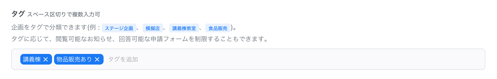

# 学園祭参加企画を手動でPortalDotsに登録・編集する

## 企画情報を手動で登録する必要があるケース

手入力による企画情報の登録は手間がかかるため、PortalDotsでは「企画参加登録」機能を利用することを推奨しています。企画参加登録機能を使えば、各企画の担当者に企画情報を入力してもらうことができます。

それでも、下記の場合では企画情報を手動で登録した方が良いと考えられます。

* PortalDotsの企画参加登録機能以外の方法で企画参加登録を受け付けた場合
* 企画参加登録の受付期間外に、特別対応として企画参加登録を受け付けた場合


PortalDotsでは「企画」は手動で登録できますが「ユーザー」は手動で登録できません。企画に所属するメンバーを登録するには、そのメンバーに対して[PortalDotsのユーザー登録を完了するように依頼する](../setup/user-registration.md)必要があります。



PortalDotsの企画参加登録機能の詳細については、「[PortalDotsを使って企画参加登録を受け付ける](../features/circle-registration.md)」をご覧ください。


## 企画情報の登録・編集方法

1. 「スタッフモード」を開きます。
2. メニューから「企画情報管理」を選びます。
3. 企画を新しく登録する場合は「新規企画」を選びます。すでに登録されている企画情報を編集する場合は、編集したい企画の✏️(編集)ボタンを選びます。
4. 以下の表に記載されている入力欄が表示されます。入力欄に入力し終わったら「保存」を選びます。

| 入力項目名                         | 説明                                                                                                                                                                                    |
| ----------------------------- | ------------------------------------------------------------------------------------------------------------------------------------------------------------------------------------- |
| **企画基本情報**                    | 企画についての基本的な情報を入力するセクションです。                                                                                                                                                            |
| 企画名・企画名(よみ)                   | 企画の名前を入力します。                                                                                                                                                                          |
| 企画を出店する団体の名称・企画を出店する団体の名称(よみ) | 学園祭に出店する企画を行う団体の名前を入力します。                                                                                                                                                             |
| 使用場所                          | 
企画が学園祭当日に利用する場所(教室・模擬店ブースなど)を選択します。「場所情報管理」機能で予め作成した場所から選択できます。

PortalDotsの「場所情報」機能の詳細は、「<a href="../features/places.md">学園祭当日に使用できる場所の一覧や各企画への場所の割り当てを管理する</a>」をご覧ください。
 |
| カスタムフォームへの回答                  | 
「企画参加登録」機能で作成した独自のフォーム(入力欄)への入力内容を編集できます。 

PortalDotsの「企画参加登録」機能の詳細は、「<a href="../features/circle-registration.md">PortalDotsを使って企画参加登録を受け付ける</a>」をご覧ください。
            |
| タグ                            | 企画をタグで分類することができます(後述)。                                                                                                                                                                |
| **企画のメンバー**                   | 企画の責任者・副責任者の情報を入力するセクションです。                                                                                                                                                           |
| 責任者の学籍番号                      | 企画の責任者の方の学籍番号を入力します。                                                                                                                                                                  |
| 学園祭係(副責任者)の学籍番号               | 企画の副責任者の方の学籍番号を入力します。複数の副責任者がいる場合、1行につき1つ学籍番号を入力でいます。                                                                                                                                 |
| **参加登録の受理設定**                 | 企画参加登録を受理したか取り下げたかを入力できるセクションです。この設定を変更すると、その企画のメンバーに対し、企画が受理された(されなかった)旨が記載されたメールが送信されます。                                                                                            |
| 参加登録の受理設定                     | 企画参加登録を受理するかどうかを選択できます(後述)。                                                                                                                                                           |
| 不受理に関する詳細(ユーザーに通知)            | (後述)                                                                                                                                                                                  |
| **スタッフ用メモ**                   | 一般ユーザーには公開されないスタッフ用のメモを入力できます。                                                                                                                                                        |

### 「タグ」について

学園祭への参加形態などに応じて企画をタグで分類することができます。また、企画のメンバーが[閲覧できるお知らせを制限](../features/pages.md#orasewonayznitsuite)したり、[回答可能な申請フォームを制限](../features/forms.md#fmuhenayznitsuite)したりする目的でもタグを利用できます。

タグ入力欄では、半角スペースで区切ることで複数のタグを設定できます。例えば、講義棟内の教室で企画を出店する企画であり、物品の販売を伴う企画の場合、タグ入力欄では下記の画像のように入力するのがおすすめです。


上記の画像の例では「講義棟」と入力していますが、「講義棟教室」などの他の表記でも構いません。ただし、全ての企画を通して表記を統一する必要があります。例えば「講義棟」タグと「講義棟教室」タグは全く別のタグであるとみなされます。


### 「参加登録の受理設定」について

企画参加登録を受理したか取り下げたかを設定できます。各企画について「確認中」「受理」「不受理」のうちから1つ設定できます。

| オプション | 説明                                                                                                                         |
| ----- | -------------------------------------------------------------------------------------------------------------------------- |
| 確認中   | 
このオプションを選択すると、企画に所属しているメンバーに対して、企画参加登録の内容が確認中である旨が表示されます。

「企画参加登録」を提出した直後の企画は、全て自動的に「確認中」として設定されます。
           |
| 受理    | 
企画参加登録の内容を受け入れる場合、このオプションを選択します。

PortalDots「申請」機能で作成した申請フォームに回答できるのは、「受理」として設定されている企画のメンバーのみです。
               |
| 不受理   | 
企画参加登録を取り下げる場合、このオプションを選択します。

また、「不受理に関する詳細」欄に不受理とした理由を記載することもできます。「不受理に関する詳細」の内容は、不受理となったことを通知するメール内に表示されます。
 |


「登録受理状況」を「受理」または「不受理」にチェックを入れると、その企画のメンバーに対し、企画が受理された(されなかった)旨が記載されたメールが送信されます。

