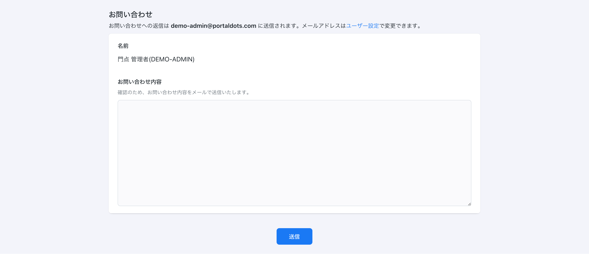
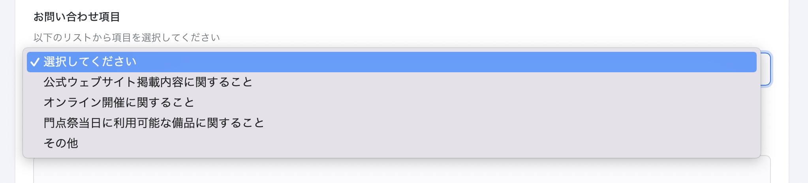

# 学園祭参加企画からのお問い合わせを受け付ける

## 概要

PortalDotsの「お問い合わせ」受付機能を利用することで、学園祭の参加企画からのお問い合わせをウェブフォームで受け付けることができます。

また、お問い合わせの内容に応じて送信先メールアドレスを振り分けることも可能です。


お問い合わせフォームからお問い合わせを送信できるのは、PortalDotsにログイン中のユーザーのみです。


## 初期状態のお問い合わせフォーム

PortalDotsのお問い合わせフォームは、特段の設定を行うことなくすぐに使うことができます。

PortalDotsをインストール後の初期状態では、ユーザーからのお問い合わせは「実行委員会のメールアドレス」に届きます。「実行委員会のメールアドレス」は、PortalDotsのインストール時に設定したメールアドレスです。

## お問い合わせの内容に応じて送信先のメールアドレスを変える (お問い合わせ受付設定)

「お問い合わせ受付設定」を変更することで、ユーザーからのお問い合わせを内容によって振り分けることができます。例えば、「学園祭の公式ウェブサイトに関するお問い合わせ」と「オンライン開催に関するお問い合わせ」を、それぞれ別のメールアドレスで受信することができます。

お問い合わせ内容を選択させる上記のセレクトボックスをお問い合わせフォームに設置するには、次の手順を行います。

1. 「スタッフモード」を開きます。
2. メニューから「お問い合わせ受付設定」を選びます。
3. 「メールアドレスを追加」を選びます。
4. お問い合わせ内容の選択肢として表示される「項目名」と、その項目を選択したときの送信先となる「メールアドレス」を入力します。
5. 入力し終わったら「保存」を選びます。


「保存」を選ぶと、ここで入力した「メールアドレス」に対して確認メールが送信されます。確認メールを受け取れていない場合、ユーザーからのお問い合わせを受け取ることができない可能性があります。メールアドレスの入力内容に間違いがないか確認してください。

