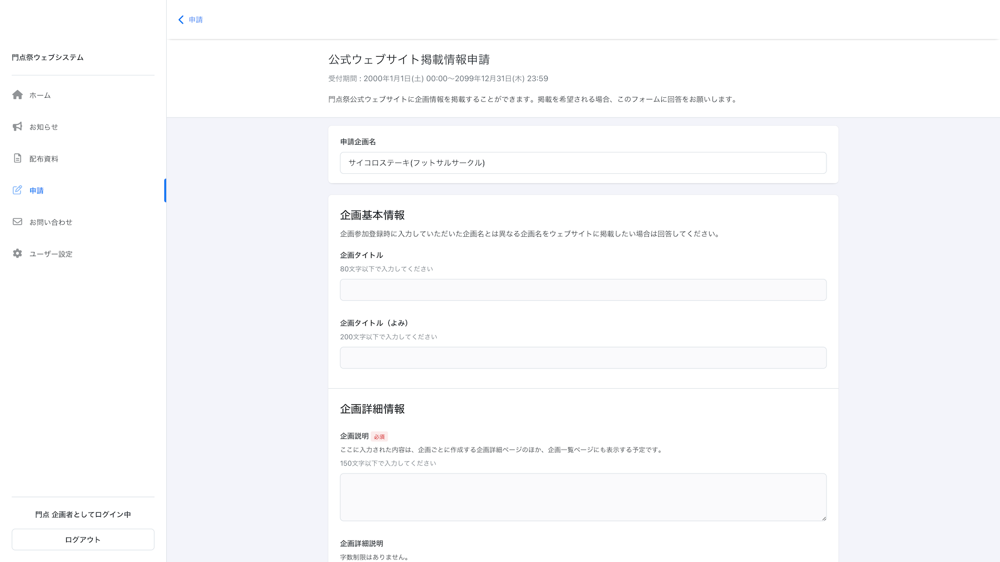

# 学園祭参加企画からの各種申請をオンラインで受け付ける

## 概要

PortalDotsの「申請管理」機能を利用することで、学園祭参加企画からの各種申請を受け付けることができます。例えば、下記のような申請の受付に利用できます。

* 場所希望調査 (学園祭当日に利用したいブース・教室などの希望を調査)
* 公式パンフレット掲載情報申請 (学園祭の来場者に配布するパンフレットに掲載する企画の紹介文を入稿してもらう)
* 備品貸出申請 (学園祭実行委員会や生協などが保有する備品の貸し出し希望を調査)
* 車両入構申請 (学園祭当日、キャンパス内に入構する車両のナンバー情報などを受付)


申請フォームに回答できるのは、「登録受理状況」が「受理」となっている企画のみです。

企画参加登録の受付方法や「登録受理状況」を変更する方法は、「[PortalDots を使って企画参加登録を受け付ける](circle-registration.md)」ページに記載しています。


## 「Googleフォーム」等のサービスとの違い

PortalDotsの申請フォームは、「Googleフォーム」等のフォーム作成サービスと同じ感覚で作成できます。しかし、PortalDotsの申請管理機能は、下記の点でGoogleフォーム等のサービスと異なります。

* ログイン機能により、他の企画になりすまして申請フォームに回答できない
  * Googleフォームは、フォームへの回答にGoogleアカウントでのログインを必須にすることはできます。しかし、「どの企画の誰か」という情報までは認証できません。
* 申請フォームの回答受付期間を設定できる
  * Googleフォームとは異なり、PortalDotsでは申請フォームの受付開始日と終了日を指定できます。
* 一度作成した回答は、申請フォームの受付期間内であれば簡単に編集できる
  * Googleフォームの場合、回答を編集するためのURLを紛失すると回答を編集できなくなります。

## 申請フォームを作成する

1. 「スタッフモード」を開きます。
2. メニューから「申請管理」を選びます。
3. 「新規フォーム」を選びます。
4. 以下の表に記載されている入力欄が表示されます。入力欄に入力し終わったら「保存」を選びます。
5. フォームエディターが表示されます。申請フォームに表示したい入力欄などを設定してください。ここで設定した内容は即座に公開(公開設定がオンの場合)されます。

| 入力項目           | 説明                                                                                       |
| -------------- | ---------------------------------------------------------------------------------------- |
| フォーム名          | 申請フォームの名前を入力します。例 : 「公式ウェブサイト掲載情報申請」                                                     |
| 企画毎に回答可能とする回答数 | 通常は「1」にします。                                                                              |
| 受付開始日時・受付終了日時  | 申請フォームへの回答を受け付ける期間を入力します。受付期間中、各企画は何度でも回答を編集できます。                                        |
| 公開設定           | 申請フォームの設問や、過去に行った回答内容を、学園祭の企画担当者が確認できるようにするかを選択します。この設定がオフの場合、回答受付期間中であっても回答を作成・編集できません。 |
| フォームへ回答可能なユーザー | （後述）                                                                                     |
| フォームの説明        | 申請フォームについての説明を入力します。この情報は企画担当者に公開されます。回答時の注意点などを企画担当者に対して説明できます。                         |
| 回答後に表示する内容        | フォームに回答した方に向けて表示するメッセージを設定できます。この内容は、回答したユーザーに自動で送信されるメールにも表示されます。                         |


フォームの入力欄(設問)を編集するには「フォームエディター」を利用します。「フォームエディター」の利用方法については、「[フォームエディターで申請フォームを作成する](../advanced/form-editor.md)」をご覧ください。


### 「フォームへ回答可能なユーザー」について

PortalDotsに登録されているユーザー全員に対してフォームを公開する必要がなく、一部のユーザーにだけ回答してほしいフォームがある場合、「フォームへ回答可能なユーザー」機能を使ってフォームに回答できるユーザーを制限できます。

例えば、「講義棟教室の電源使用申請」というフォームを、講義棟を利用する企画のメンバーに対してだけ公開したい場合、以下のように設定してください。

1. 予め「企画情報管理」で、講義棟を利用する企画の「企画タグ」入力欄に「**講義棟**」と入力しておく。
2. 「フォーム」作成画面にある「フォームへ回答可能なユーザー」入力欄に「**講義棟**」と入力する。
3. フォームを保存する。

## フォームに集まった回答を確認する

各企画から集めたフォームへの回答を確認するには、下記の手順を行います。回答一覧の確認画面では、集まった回答をCSVファイルとしてダウンロードすることもできます。

1. 「スタッフモード」を開きます。
2. メニューから「申請管理」を選びます。
3. 集まった回答を確認したいフォームにある、目のアイコン(回答一覧)ボタンを選びます。
4. フォームに集まった回答の一覧が表示されます。

## 回答が作成・編集されたときに送信されるメールについて

各企画がフォームに対して回答を作成・編集すると、下記のユーザーに回答確認メールが送信されます。

* 回答したユーザーが所属する企画のメンバー全員
  * 回答したユーザーがPortalDots上で複数の企画に所属している場合、回答を作成した企画に対してのみメールが送信されます
* フォームを一番最初に作成したスタッフユーザー


現時点では、これらのメールの送信を停止することはできません。

