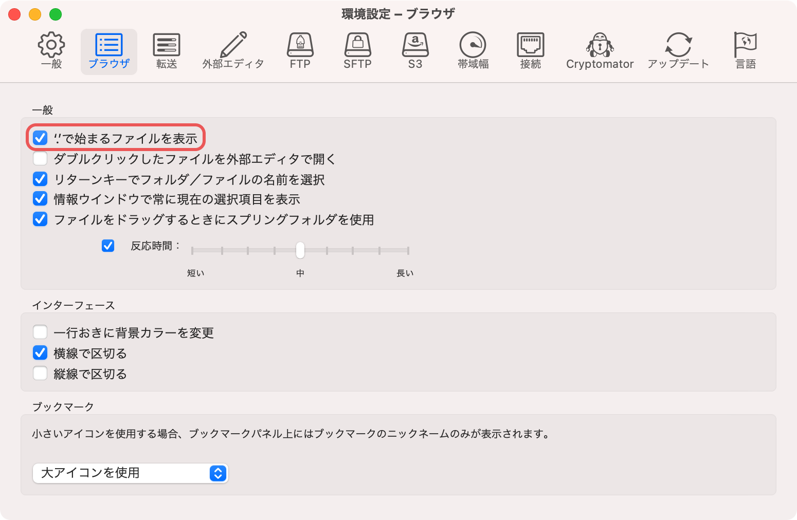

# ステップ5. PortalDotsをサーバーにアップロードする


ブラウザ上で利用できる「ファイルマネージャー」では PortalDotsをアップロードできません


1. コアサーバー申込み時に届くメール（件名 : CORESERVER.JP NEW SIGNUP）に記載されている「**アカウント名(FTPユーザー名)**」「**パスワード**」「**ＦＴＰサーバー**」を確認、メモします。
2. FTPソフトでFTP接続します。FTPソフトをインストールしていない場合、Cyberduckがお勧めです。設定方法はロリポップ！レンタルサーバーのサポートページに掲載されています([Macの場合](https://lolipop.jp/manual/hp/m-cyberduck/) / [Windowsの場合](https://lolipop.jp/manual/hp/w-cyberduck/))。
   * Cyberduckの場合、「環境設定」内の「ブラウザ」タブにある「'.'で始まるファイルを表示」にチェックを入れてください\
     
3. Cyberduckの画面上の「public\_html」フォルダをダブルクリックして開きます。
4. 初期状態ではいくつかのファイルが設置されています。これらは不要なため、ファイル上で右クリックして削除します。
5. [PortalDots.zip](https://github.com/portaldots/PortalDots/releases/latest/download/PortalDots.zip) をダウンロードし、展開します。
6. 展開してできたフォルダの中身を全て「public\_html」フォルダ内へアップロードします。Cyberduckの場合、Finder(macOSの場合)またはエクスプローラー(Windowsの場合)からファイルをドラッグ&ドロップしてください。
   * 隠しファイル(ドットで始まるファイル)も含めてアップロードしてください。macOS や Linux などの OS では、デフォルトではこれらのファイルは非表示になっています。macOS の場合、Finder で Command + Shift + . を押すと隠しファイルが表示されます。\
     .png>)
7. アップロードには5分〜10分程度時間がかかりますので、お待ちください。
8. アップロードが完了したら、コアサーバーのコントロールパネルにログインします。
9. 画面左のメニューから「ドメイン」をクリックします。
10. ドメイン一覧の表に記載されている「〇〇.△△.coreserver.jp」という形式のURLを確認、メモします。
11. 先ほど確認したURLの先頭に「https://」をつけたURLにアクセスしてください。
    * 先ほど確認したURLが「〇〇.△△.coreserver.jp」の場合、「 https://〇〇.△△.coreserver.jp 」にアクセスしてください。
12. 「PortalDotsへようこそ！」という画面が表示されたら、アップロード完了です。

.png>)


「PortalDotsへようこそ！」の画面が表示されず、 `Composer detected issues in your platform: Your Composer dependencies require a PHP version ">= x.x.x".` のような画面が表示される場合、PHPバージョンの変更が必要です。

[コアサーバーのマニュアル](https://help.coreserver.jp/manual/v2/php-version/)を参考に、PHPバージョンを**8.0以上に変更**してください。

