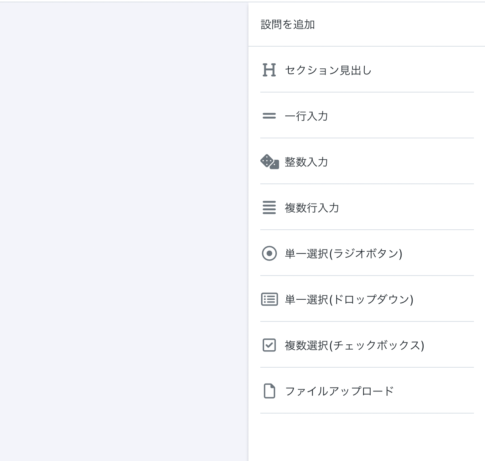

# フォームエディターで申請フォームを作成する

## 概要

PortalDotsの「フォームエディター」を利用すると、プログラミング不要の直観的な操作で申請フォームを作成することができます。


フォームエディター


## フォームエディターを起動する

既に作成済みの申請フォームを編集したい場合や、企画参加登録フォームに追加した独自の入力欄（カスタムフォーム）を編集したい場合、次の方法でフォームエディターを起動することができます。

### 申請フォームを編集する

1. 「スタッフモード」を開きます。
2. メニューから「申請管理」を選びます。
3. 編集したいフォームの✏️(編集)ボタンを選びます。
4. 「フォームエディターを開く」を選びます。

### 企画参加登録フォームの独自の入力欄(カスタムフォーム)を編集する

1. 「スタッフモード」を開きます。
2. メニューから「企画情報管理」を選びます。
3. 「企画参加登録機能の設定」を選びます。
4. 「企画参加登録機能を有効にする」ボタンが表示されている場合、「企画参加登録機能を有効にする」ボタンを選びます。
5. 「フォームエディターを開く」を選びます。

## 設問(入力欄)をフォームに追加する

フォームエディターの画面右側にある「設問を追加」サイドバーから、フォーム内に設問(入力欄)を追加することができます。

| 設問タイプ          | 説明                                                                                 |
| -------------- | ---------------------------------------------------------------------------------- |
| セクション見出し       | 複数の設問をセクションにまとめることができます。この設問タイプには入力欄がありません。見出しとして利用できるほか、フォーム内に説明文を表示する目的でも利用できます。 |
| 一行入力           | 1行だけ入力できる入力欄(テキストボックス)です。                                                          |
| 整数入力           | 整数を入力できる入力欄(テキストボックス)です。数字以外の文字を入力することはできません。                                      |
| 複数行入力          | 入力内容に改行を含めることができる入力欄(テキストボックス)です。                                                  |
| 単一選択(ラジオボタン)   | 複数の選択肢から1つだけ選択できる入力欄です。                                                            |
| 単一選択(ドロップダウン)  | 複数の選択肢から1つだけ選択できる入力欄です。                                                            |
| 複数選択(チェックボックス) | 複数の選択肢から2つ以上選択できる入力欄です。                                                            |
| ファイルアップロード     | ファイルをアップロードできる入力欄です。                                                               |

## 設問を編集する

フォームエディターに追加した設問をクリックすると、その設問に関する情報を編集することができます。設定可能な項目は、設問タイプによって異なります。

.png>)

### 全設問タイプ共通の設定項目 (セクション見出しを除く)

| 設定項目  | 説明                                                    |
| ----- | ----------------------------------------------------- |
| 回答必須か | 回答を必須とする場合はオンにします。回答必須の設問が未回答の場合、申請フォームを提出することができません。 |
| 設問名   | 入力欄の名前として表示するテキストを入力します。                              |
| 説明    | 入力欄の説明として表示するテキストを入力します。                              |

### セクション見出し

| 設定項目 | 説明                     |
| ---- | ---------------------- |
| 見出し  | 見出しとして表示するテキストを入力します。  |
| 説明   | 見出しの下に表示されるテキストを入力します。 |

### 一行入力・複数行入力

| 設定項目        | 説明                   |
| ----------- | -------------------- |
| 最小文字数・最大文字数 | 入力欄に入力できる文字数を制限できます。 |

### 整数入力

| 設定項目    | 説明                          |
| ------- | --------------------------- |
| 最低数・最大数 | 入力欄に入力できる数値の最小値・最大値を制限できます。 |

### 単一選択(ラジオボタン)・単一選択(ドロップダウン)

| 設定項目 | 説明                                                      |
| ---- | ------------------------------------------------------- |
| 選択肢  | 選択肢として表示する内容を入力します。複数の選択肢から選択させる場合、1行につき選択肢を1つ入力してください。 |

### 複数選択(チェックボックス)

| 設定項目        | 説明                                                      |
| ----------- | ------------------------------------------------------- |
| 選択肢         | 選択肢として表示する内容を入力します。複数の選択肢から選択させる場合、1行につき選択肢を1つ入力してください。 |
| 最小選択数・最大選択数 | チェック可能な数を制限できます。                                        |

### ファイルアップロード

| 設定項目      | 説明                                                                         |
| --------- | -------------------------------------------------------------------------- |
| 最大サイズ(KB) | アップロード可能なファイルサイズをキロバイト(KB)単位で制限できます。                                       |
| 許可される拡張子  | アップロード可能なファイルの拡張子を指定できます。**「許可される拡張子」が未設定の場合、ユーザーはファイルをアップロードすることができません。** |
