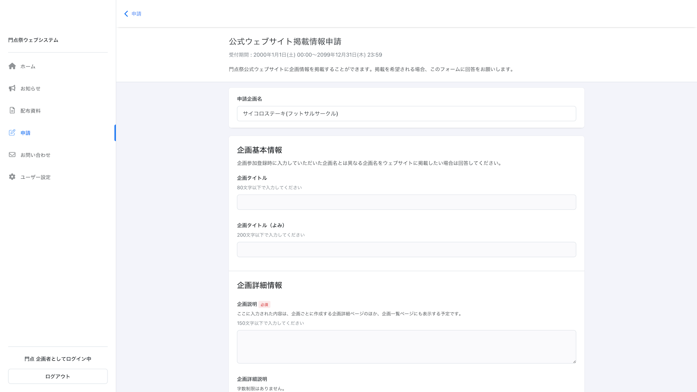
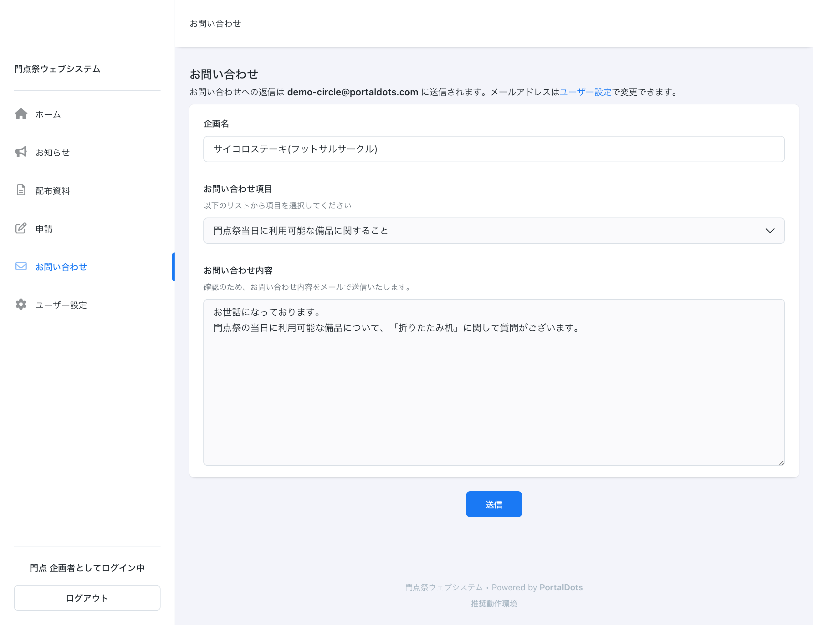

# PortalDotsでできること(一般モード)

一般モードには下記の機能があります。

## 企画参加登録

学園祭への参加登録を行うことができます。企画参加登録の受付期間に限り、参加登録の作成・提出を行うことができます。


一般ユーザーが企画参加登録を行えるようにするには、予めスタッフモード内での設定が必要です。詳細は、「[PortalDotsを使って企画参加登録を受け付ける](circle-registration.md)」をご覧ください。


## お知らせの閲覧

学園祭の参加企画向けのお知らせを閲覧することができます。


お知らせを作成・編集する方法については、「[学園祭参加企画向けのお知らせを掲載・メール配信する](pages.md)」をご覧ください。


## 配布資料の閲覧

学園祭の参加企画向けに配布されている資料(ファイル)を閲覧することができます。


配布資料を作成・編集する方法については、「[学園祭参加企画にPDFなどのファイルを配布する](documents.md)」をご覧ください。


## 申請フォームへの回答

申請フォームに回答することができます。申請フォームの受付期間中であれば、回答済みの申請フォームを編集することもできます。


申請フォームを作成・編集する方法については、「[学園祭参加企画からの各種申請をオンラインで受け付ける](forms.md)」をご覧ください。


## 学園祭実行委員会へのお問い合わせ

学園祭実行委員会に対してお問い合わせを送信することができます。お問い合わせフォームを送信するには、PortalDotsにログインしている必要があります。


PortalDotsの機能のうち、学園祭の実行委員(スタッフ)が利用可能な機能については「[PortalDotsでできること(スタッフモード)](../features/list.md)」をご覧ください。

